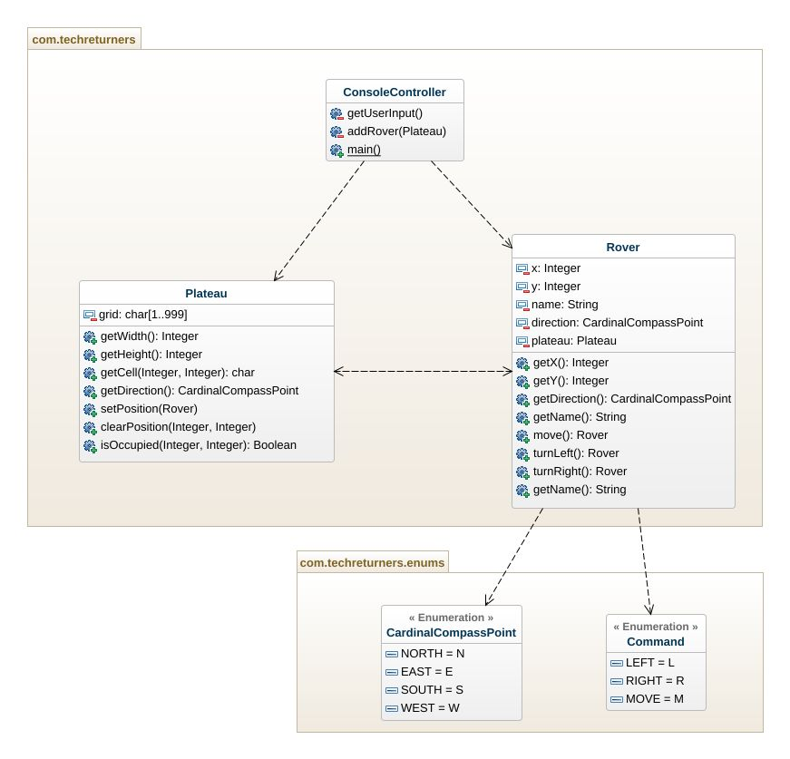

# MARS ROVER 🚀
> Brief  
> You’re part of the team that make Mars Rover.  
> Develop the simulator program that takes commands and a map.  
> Translate the commands and show the result position and direction of the Rover.
## Table of contents
* [General info](#general-info)
* [How to build the project](#how-to-build-the-project)
* [How to run the project](#how-to-run-the-project)
* [Room for improvement](#room-for-improvement)
* [UML diagram](#uml-diagram)
## General info
- This kata implements a user interface on the terminal to control rovers in a two dimensional plane.
## How to build the project
- Open a terminal and run:  
`mvn clean compile`
## How to run the project
- On the command line execute :  
`java -cp target/classes com.techreturners.ConsoleController`
- Please enter the width and height of the plateau
- Enter the direction (N, S, E, W) the rover is facing,  and the rover‘s starting point (x, y)
- Enter the list of commands to move and turn the rover (⬆️ : move forward, ➡️ : turn right 90°, ⬅️ : turn left 90°)
- When the rover encounters an obstacle, it does nothing.
## Room for improvement
- Aliens 👽👾
## UML diagram

